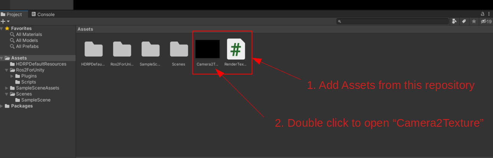
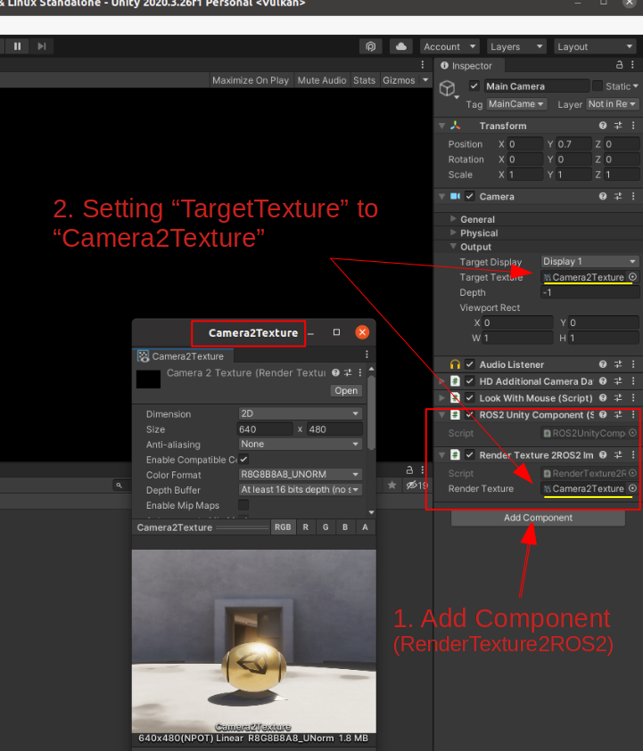
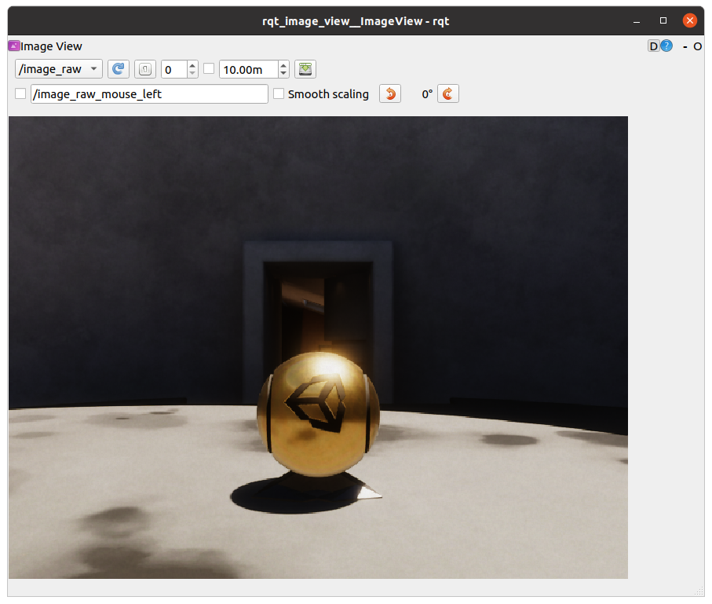

# RenderTexture2ROS2Image

Bridge between RenderTexture (Unity) object and sensor_msgs/Image (ROS2).

The size of the image to be published depends on the value set in RenderTexture.


## Requirements

- ROS2 Foxy
- Unity 2020
- [ros2-for-unity](https://github.com/RobotecAI/ros2-for-unity)

### Run on Unity

1. Create Project (3D World)
2. Add Assets from this repository



3. Add Components
4. Setting "TargetTexture" to "Camera2Texture"



5. Push Play button

### Check image topic using ROS2

```
source /opt/ros/foxy/setup.bash
ros2 run rqt_image_view rqt_image_view
```



## About writer
- Ar-Ray : Japanese student.
- Blog (Japanese) : https://ar-ray.hatenablog.com/
- Twitter : https://twitter.com/Ray255Ar